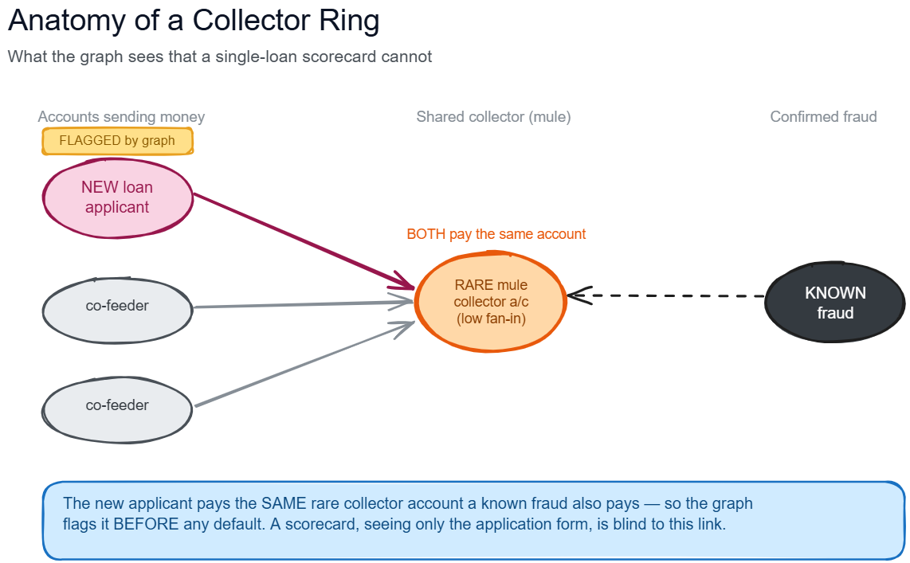

# Use of Graph Analytics in Onboarding Frauds

This repository is a publication-safe portfolio version of an internship project completed in the Business Intelligence Unit (BIU) at Axis Bank. It explores how transaction-network structure can supplement applicant-level risk models by identifying shared counterparties, short paths to known fraud, dense subgraphs, communities, and suspicious money-flow motifs.

The repository contains no customer records, account identifiers, credentials, internal data extracts, internal table names, or bank-specific quantitative results. It is an independent technical portfolio and is not an official Axis Bank repository or product.

## Why graph analytics?

Conventional onboarding models score one application at a time. That view can miss relationships that only become visible when customers, accounts, counterparties, and transactions are represented as a graph. A new applicant may look ordinary in isolation while sharing a rare collector account, cash-out point, community, or short transaction path with previously confirmed fraud.

The project therefore treats graph signals as an explainable early-warning layer rather than a replacement for established fraud controls.



The diagram is conceptual and uses synthetic labels; it contains no customer or account data.

## Public project scope

The public version starts from a normalized, institution-neutral graph contract. Employer-specific extraction and infrastructure code is intentionally excluded.

The analytical workflow covers:

1. point-in-time seed and candidate construction;
2. bounded multi-hop subgraph extraction;
3. degree, proximity, shared-neighbour, and diffusion features;
4. community and fraud-motif features;
5. incremental feature selection and leakage-aware validation;
6. transparent blended scoring and a WOE-logistic alternative;
7. analyst-facing reason codes and graph investigation views;
8. unsupervised anomaly features for graph-isolated applicants.

See [architecture](docs/architecture.md), [methodology](docs/methodology.md), and the [normalized data contract](docs/data-contract.md) for details.

## Repository layout

```text
.
|-- docs/                         Public methodology and data contracts
|-- examples/                     Synthetic, runnable demonstration
|-- notebooks/pipeline/           Generalized, output-free Spark notebooks
|-- src/onboarding_fraud_graph/   Small dependency-free graph feature library
|-- tests/                        Unit tests for the synthetic implementation
|-- tools/                        Publication-safety checks
`-- _private/                     Local-only archive; ignored by Git
```

The Spark notebooks are output-free reference implementations intended for a managed Spark environment and require tables satisfying the public data contract. They do not contain the bank-specific ingestion layer, executed results, or real identifiers.

## Quick start

The synthetic example uses only the Python standard library:

```bash
python -m pip install -e .
python examples/synthetic_demo.py
python -m unittest discover -s tests -v
```

Before creating a commit, run:

```bash
python tools/check_publication.py
```

## Main feature families

| Family | Examples | Rationale |
|---|---|---|
| Local structure | in/out degree, rare-counterparty counts | Captures unusual fan-in or fan-out behaviour |
| Known-risk proximity | minimum hops, closeness, personalized diffusion | Measures network exposure to historical fraud seeds |
| Shared infrastructure | shared rare beneficiary or cash-out point | Finds applicants using the same low-prevalence infrastructure as known fraud |
| Group structure | connected components, label-propagation communities | Detects clustered risk that is weak at the individual-node level |
| Motifs | collector rings, cycles, pass-through chains, dense blocks | Represents interpretable laundering and coordination patterns |
| Model validation | capture at K, lift, sloping, out-of-time checks | Tests whether each signal adds stable operational value |

## Important publication note

Bank internship work may be subject to employment, confidentiality, privacy, trademark, and intellectual-property restrictions. The local `_private/` archive is deliberately excluded from Git. Do not force-add it, and obtain any required employer or university approval before publishing this repository.

No open-source license is included. Choose a license only after confirming that you have the right to publish and license the material.
