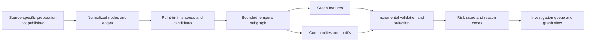

# Architecture

The publication-safe workflow begins after institution-specific source data has been transformed into a normalized graph contract.

## Layers

### 1. Normalized graph

Accounts and other entities become typed nodes. Transactions and structural relationships become typed edges. Identifiers are pseudonymous and stable only within the authorized analytical environment.

### 2. Point-in-time analytical frame

For each decision month, historical confirmed fraud is used as the seed set. New applicants form the candidate set. Features use only events available before the decision cutoff; candidate outcomes are held back for evaluation.

### 3. Subgraph construction

A bounded iterative expansion finds the neighbourhood around seeds and candidates. High-degree public infrastructure can be marked or prevented from expanding the frontier so it does not pull most of the network into the working graph.

### 4. Feature computation

The Spark pipeline computes local degree measures, time-respecting proximity, shared rare neighbours, personalized diffusion, components, and communities. Motif stages add collector rings, shared cash-out infrastructure, cycles, pass-through behaviour, and dense-block scores.

### 5. Selection and scoring

Features are assessed incrementally against a transparent baseline. Selection is based on operational rank metrics and out-of-time stability. The final stage supports both an interpretable percentile-rank blend and a regularized WOE-logistic scorecard.

### 6. Investigation output

Ranked candidates receive plain-language reason codes. Small ego graphs expose the paths or shared infrastructure behind a score so an analyst can review the evidence.

## What is deliberately absent

The public repository does not contain employer-specific source queries, authentication setup, cluster paths, data dictionaries, production counts, customer-level examples, fitted coefficients, exported internal reports, or proprietary results.
